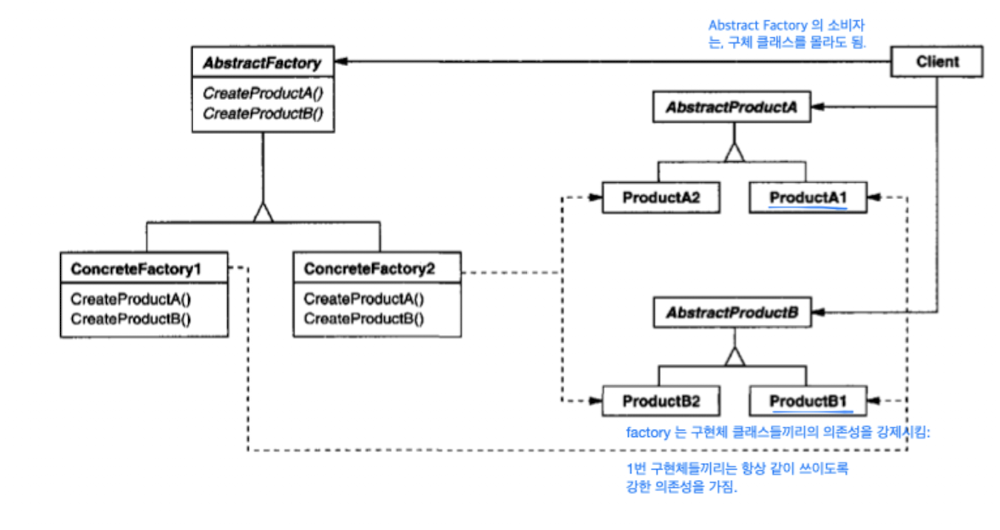
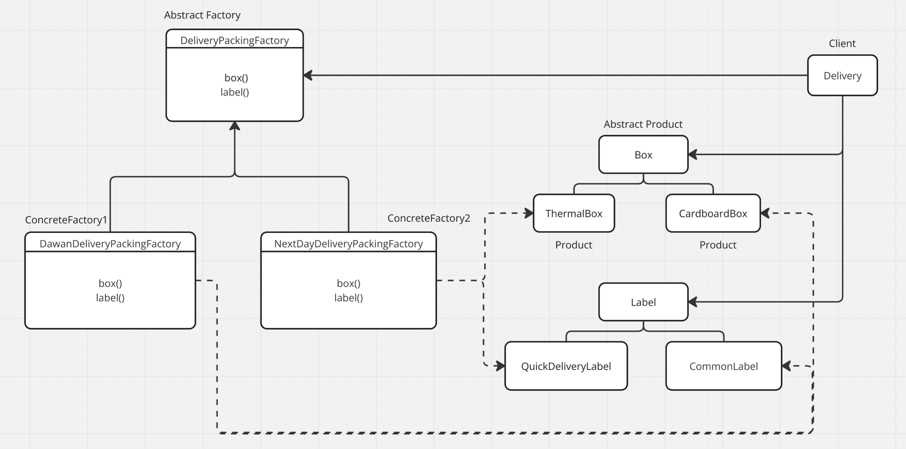
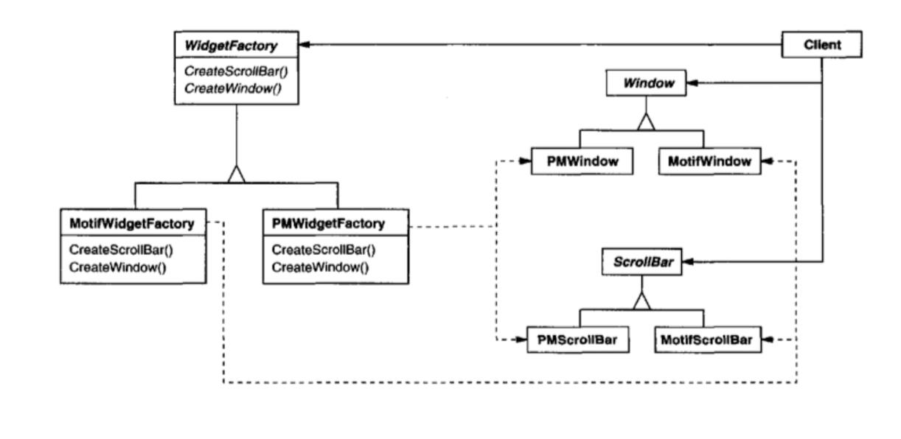

### 연관된 패턴

- Factory Method: Abstract Factory 는 Factory Method 로 구현되고는 함
- Singleton: Concreate Factory 는 Singleton 으로 구현되고는 함

### 정의

구체적인 클래스들을 명시하지 않고도, 관련되거나 의존적인 객체들의 ‘묶음(family)’을 생성할 수 있는 인터페이스를 제공.
ConcreteFactory를 통해 다양한 제품군을 생성하고, 구체적인 클래스에 의존하지 않는 설계를 제공한다.

> Provide an interface for creating families of related or dependent objects without specifying their concrete classes.

### 구성요소

- **AbstractFactory**: 추상 제품 객체를 생성하는 작업을 선언하는 인터페이스.
    - AbstractFactory는 제품 객체 생성 책임을 ConcreteFactory 하위 클래스에 위임.
- **ConcreteFactory**: 구체적인 제품 객체를 생성하기 위해 AbstractFactory의 작업을 구현.
    - 특정 구현을 가진 제품 객체를 생성
- **AbstractProduct**: 특정 유형의 제품 객체에 대한 인터페이스를 선언.
- **ConcreteProduct**: AbstractProduct를 구현하여 해당 구체적인 팩토리가 생성하는 제품 객체를 정의.
- **Client**: 소비자로서 AbstractProduct 에 의존.
    - 구체적인 구현 세부사항을 알 필요 없이 제품 객체를 생성

### Pros & Cons

- **구체 클래스의 분리**
    - 팩토리가 제품 객체 생성 과정과 책임을 캡슐화하기 때문에 클라이언트는 구현 클래스에서 분리
    - 구체 클래스 이름은 구현 코드에만 나타나고 클라이언트 코드에는 나타나지 않음
- **제품군 교체가 용이**
    - 구체 팩토리 클래스는 애플리케이션 내에서 한 번만 인스턴스화 됨.
- **제품 간 일관성 유지**
    - 동일한 제품군에 속한 객체들은 함께 작동하도록 설계
- **새로운 종류의 제품 지원의 어려움**
    - Abstract Factory의 인터페이스는 생성 가능한 제품 집합을 고정하기 때문.
    - 즉, 새로운 제품을 추가하기 위해서는, 모든 하위 클래스를 구현해야 함.

### 내 코드 예시

### 책의 예시

필앤굿 예시. 안드로이드 전용 위젯 디자인과 아이폰 전용 위젯 디자인을 하나의 Factory 구현체가 묶어줌.

