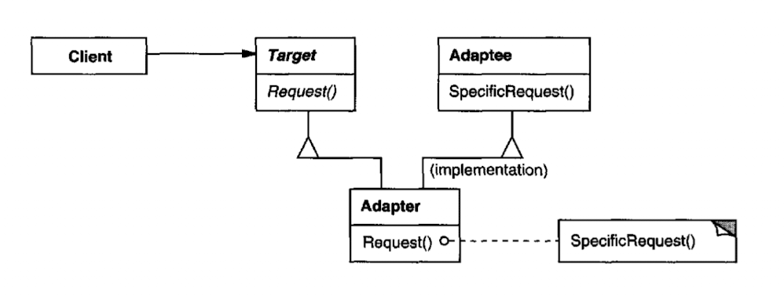
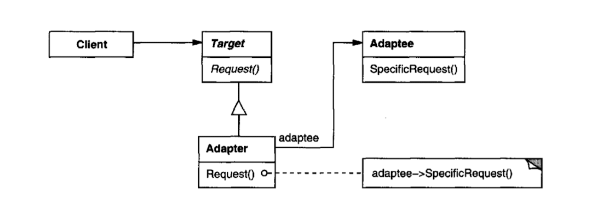

### 의도

특정 인터페이스를 소비자가 기대하는 인터페이스로 적응(변환) 시킵니다.
서로 일치하지 않는 인터페이스를 갖는 클래스들을 함께 동작합니다.

### 활용성

- 기존 클래스를 사용하고 싶은데, 인터페이스가 적절하지 않을 때
- 재사용 가능한 라이브러리를 수정할 수 없을 때.

### 구조

- 클래스적응자: 다중상속으로 adapter 를 구현
  
- 객체적응자: adapter 에서 객체 합성
  

### 구성요소

- Target: 소비자에게 노출시키고 싶은, 응용 분야에 종속적인 인터페이스를 정의하는 클래스
- Adaptee: 인터페이스의 적응이 필요한 기존 클래스. 적응대상자
- Adapter: Target 인터페이스에 Adaptee 의 인터페이스를 적응시킨 클래스

### 특징

- 클래스적응자의 장단점
    - 구현에 대한 상속이 아니기 때문에 Adaptee 의 서브클래스를 정의된 기능들을 사용할 수 없음.
    - 상속 받고 있기 때문에 Adaptee 에 정의된 행동을 Adapter 에서 재정의 할 수 있음.
- 객체적응자의 장단점
    - Adapter 하나만 존재해도 여러개의 adpatee 클래스들과 동작할 수 있음
    - Adaptee 의 행동을 재정의 할 수 없음
- 고려사항
    - Target 인터페이스와 Adaptee 간에 얼마만큼의 유사성을 갖는가에 따라, 적응(Adapting)에 너무 많은 공수가 들어갈 수 있음. 새롭게 구현하는 것과 공수를 따져야 함
    - 대체가능한 Adapter: 클래스 재사용을 높이려면, 누가 이 클래스를 소비할 것인지에 대해서 생각을 최소화 해야함. 즉 Adaper 를 만능 클래스로 만들지 말 것. 그냥 상황에 따라 적절한
      Adapter 를 만드는 것이 더 적절할지도 모름.

### 관련 패턴

- 가교패턴: 클래스 구조가 유사하지만 사용 목적이 다름. 가교 패턴은 구현과 추상 개념을 분리하는 것이 목적임.
- 장식자패턴: 다른 인터페이스의 변경 없이도 객체에 새로운 행동을 추가. 적응자보다는 소비자에게 더 좋은 방법이며, 재귀적 합성이 가능해짐.
- 프록시패턴: 다른 객체에 대한 대표자 또는 대리인 역할을 수행하지만, 인터페이스를 변경하는 책임은 없음.

### 내 예제

- 어떤 API 연동에서, 본인들이 제공하는 암호화 전용 클래스를 쓰도록 강제하고 있었음.
- 그러나 그 라이브러리에는 우리 서비스에서 사용하고 싶지 않은 시그니처들과, 중국어로 네이밍한 매서드가 있었음.
- 암호화 클래스를 우리 서비스의 용도에 맞게, adaptor 클래스에서 합성하여 사용