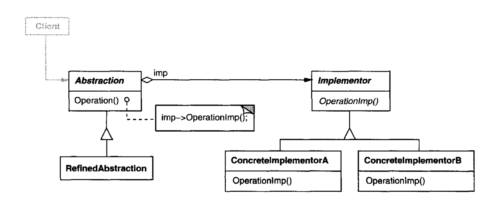
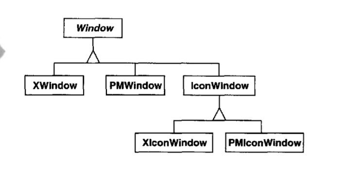
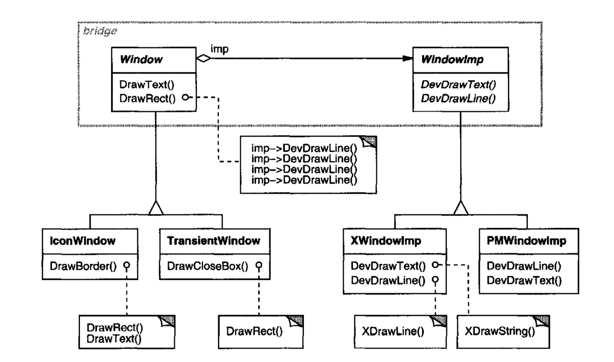

### 의도

구현에서 추상을 분리하여, 독립적으로 다양성을 가질 수 있도록 함.

### 동기

- 하나의 추상적 개념이 여러 구현으로 구체화가 가능할 때, 대부분은 새로운 서브클래스들에서 서로 다른 방식으로 인터페이스를 구현함. 그렇지만 상속은 구현과 추상적 개념을 영국적으로 종속시키면서, 개념과 구현을
  분리해야 재사용하거나 수정 및 확장하기가 쉽지 않음.
- 예를들어 다음과 같이 icon 을 X 환경에 적용하기 위해 서브클래스의 서브클래스를 만든다면, Window 인터페이스가 X 환경의 구현에 종속적으로 만들어짐 -> 윈도우를 만들 떄 마다, 특정 구현을 가진
  구현체를 인스턴스화 해줘야 함.
  
- 가교는 추상적 개념에 해당하는 클래스 계통과 구현에 관련된 클래스 계통을 분리해서 문제를 해결함
- 구현에 대한 인터페이스를 포함의 관계로 정의.
  

### 활용성

- 즉 런타임에 구현 방법을 변경해야 할 때
- 추상적 개념과 구현 모두가 독립적으로 서브클래싱을 통해 확장되어야 할 때
- 추상적 개념에 대한 구현 내용을 변경하는 경우, 다른 구현에 영향을 미치지 않아야 할 때

### 구성요소

- Abstraction: 추상적 개념에 대한 인터페이스를 제공하고, Implementor 에 대한 참조자를 관리
- RefinedAbstraction: 추상적 개념에 정의된 인터페이스 확장
- Implementor: 구현 클래스에 대한 인터페이스
- ConcreteImplementor: 실체적인 구현을 담음

### 특징

- 인터페이스와 구현을 분리: Abstraction 과 Implementor
- 확장성 제고: 분리로 인해 각각 독립적인 확장 가능
- 구현 세부 사항을 사용제에게 은닉

### 관련 패턴

- 추상 팩터리 패턴을 통해 특정 가교를 생성하고 복합할 수 있도록 할 수 있음
- 적응자패턴은 서로 관련 없는 클래스들이 함께 동작할 수 있게 특화되어 있어서 설계가 끝난 후에 적용됨. 그렇지만 가교 패턴은 설계 단계에서 투입되어 추상화 및 구현이 독립적으로 다양화 될 수 있음

