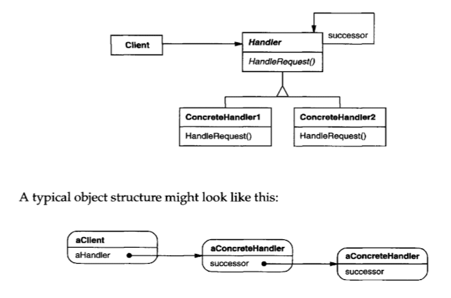

### 의도

요청을 받는 객체를 명시하지 않고, 여러 객체에게 기회를 주어 요청을 처리할 수 있도록 합니다.
요청을 체인 상의 객체들에게 전달하여 그 중 하나가 요청을 처리하도록 합니다.

### 활용성

- 여러 객체 중 하나가 요청을 처리할 수 있으며, 어떤 객체가 처리할지 미리 정해지지 않은 경우
- 요청을 특정 수신자에게 명시적으로 보내지 않고도 처리할 수 있도록 하고 싶은 경우
- 요청을 처리할 수 있는 객체 집합이 동적으로 지정되어야 하는 경우

### 구조



### 구성요소

- **Handler**
    - 요청을 처리하는 인터페이스를 정의합니다.
    - 선택적으로 다음 처리자를 가리키는 링크를 구현합니다.
- **ConcreteHandler**
    - 자신이 처리할 수 있는 요청이면 직접 처리하고, 그렇지 않으면 후속 핸들러에 요청을 전달합니다.
- **Client**
    - 요청을 체인의 첫 번째 Handler에게 전달합니다.

### 특징

1. **결합도 감소**
    - 요청을 보내는 객체와 처리하는 객체 간의 결합을 피할 수 있습니다.
    - 객체는 요청이 적절히 처리될 것이라는 것만 알고 있으며, 누가 처리하는지는 알 필요가 없습니다.
    - 체인 구조를 몰라도 객체 간 요청 처리가 가능합니다.

2. **책임 분산의 유연성**
    - 런타임 중에 체인을 변경하거나, 새로운 핸들러를 삽입함으로써 책임을 유연하게 분산할 수 있습니다.
    - 서브클래싱을 통해 각 객체가 처리할 수 있는 책임을 정적으로 지정할 수도 있습니다.

3. **요청이 처리되지 않을 가능성**
    - 요청을 반드시 처리할 객체가 존재한다는 보장이 없으며, 체인의 끝까지 전달되더라도 처리되지 않고 끝날 수 있습니다.

### 관련 패턴

- **복합체 패턴(Composite Pattern)**:
    - Chain of Responsibility는 종종 Composite과 함께 사용됩니다.
    - 이 경우, 컴포넌트의 부모가 다음 책임 처리자(successor) 역할을 할 수 있습니다.

### 내 예제

알림 메시지 처리기 구성  
• 작업 완료, 메신저, 일반 알림을 구분하여 각각의 핸들러가 처리

```
