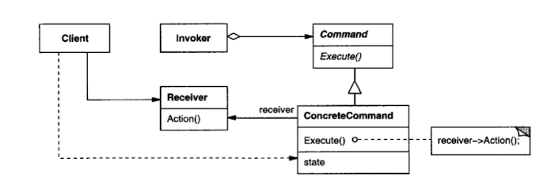
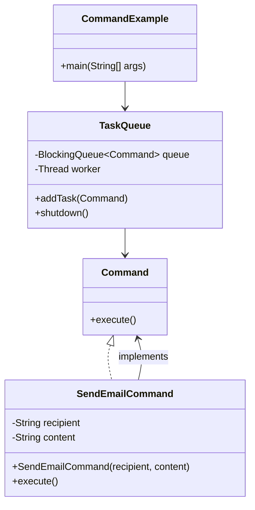

### 의도

요청을 객체로 캡슐화하여 서로 다른 요청, 큐 요청, 로그 요청, 실행 취소 작업 등을 파라미터화할 수 있도록 합니다.

### 활용성

- 요청을 큐에 저장하거나 로그로 남겨야 할 때
- 실행 취소(undo) 기능이 필요한 경우
- 명령을 기록하여 나중에 재실행할 수 있도록 할 때
- GUI 버튼, 메뉴 등에서 요청의 실행 객체를 몰라도 되도록 설계할 때

### 구조

### 구성요소

- Command: 실행 명령을 선언하는 인터페이스
- ConcreteCommand: 명령 실행을 구현하며, 실제 작업을 수행하는 수신자(Receiver)를 호출
- Receiver: 명령이 수행하는 실제 작업을 알고 있는 객체
- Invoker: 명령을 요청하는 객체 (예: 메뉴 항목)
- Client: 명령 객체와 수신자를 연결하고 Invoker에 명령을 설정

### 특징

1. 실행 객체와 요청 객체를 분리하여 결합도를 낮춤
2. 명령을 객체로 다뤄서 로그, 큐잉, 실행 취소 등 부가기능 추가가 쉬움
3. 명령을 조합하여 복합 명령(MacroCommand) 구성 가능
4. 기존 코드를 변경하지 않고 새 명령 추가 가능

### 내 예제

비동기 이메일 발송 작업 큐  
Command 패턴을 사용해 `SendEmailCommand`를 정의하고, `TaskQueue`가 명령을 큐에 저장하여 순차적으로 실행합니다.  
`Command` 인터페이스로 실행을 추상화하고, `SendEmailCommand`는 수신자와 내용을 담아 실행 시 콘솔에 출력합니다.

### 관련 패턴

- 복합체 패턴(Composite): 복합 명령(MacroCommand)을 구현할 때 사용
- 메멘토 패턴(Memento): 명령 실행 상태를 저장하여 되돌리기(undo)에 활용
- 프로토타입 패턴(Prototype): 명령을 복제하여 히스토리 리스트에 저장할 때 유용
