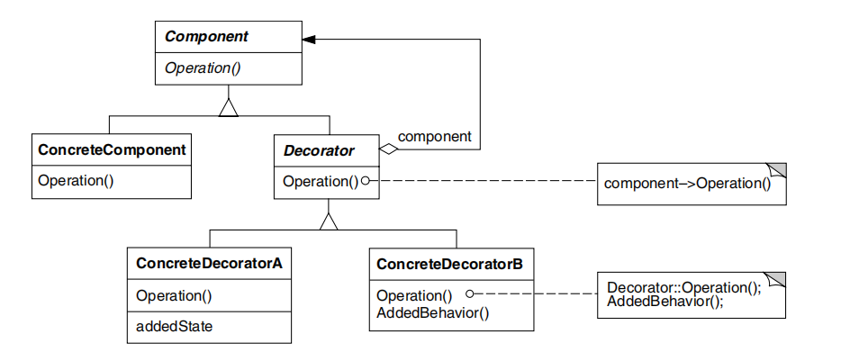
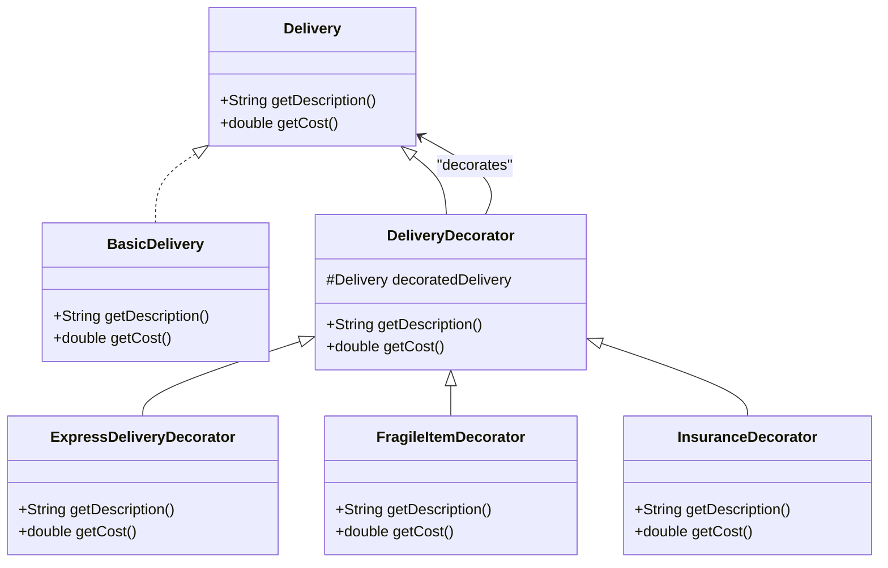

### 의도

객체에 추가적인 책임(기능)을 동적으로 부여할 수 있도록 합니다.
클래스 상속을 사용하지 않고도 기능을 확장할 수 있습니다.

### 활용성

- 기존 객체의 구조를 변경하지 않고 기능을 추가할 때
- 여러 기능을 조합하여 유연한 동작을 제공할 때
- 상속을 사용할 경우 클래스 수가 지나치게 많아지는 것을 방지할 때

### 구조

### 구성요소

- Component: 기능을 정의하는 인터페이스 또는 추상 클래스
- ConcreteComponent: 기본 기능을 구현하는 실제 객체
- Decorator: Component 를 구현하며, ConcreteComponent 를 감싸는 역할을 하는 추상 클래스
- ConcreteDecorator: 새로운 기능을 추가하는 구체적인 데코레이터 클래스

### 특징

1. 단순한 상속보다 설계가 유연해짐

- 상속을 사용하면 기능을 확장할 때 새로운 하위 클래스를 만들어야 하지만, 장식자 패턴을 사용하면 기존 클래스를 변경하지 않고 새로운 기능을 조합할 수 있음.
- 실행 중 특정 기능을 추가하거나 제거할 수 있어 동적 확장이 가능함.

2. 상위 클래스에 많은 기능이 쌓이는 것을 피할 수 있음

- 클래스에 직접 기능을 추가하면 유지보수성이 떨어지고, 기능이 많아질수록 복잡도가 증가함.
- 장식자 패턴을 사용하면 각 기능을 독립적인 클래스로 분리하여 관리할 수 있어 단일 책임 원칙(SRP)에 부합함.

3. 장식자와 장식되는 객체(기본 컴포넌트)는 동일한 구조를 가지지만 역할이 다름

- 장식자(Decorator)는 기본 컴포넌트(Component)와 같은 인터페이스를 구현하지만, 기능을 확장하는 역할을 함.
- 즉, 기본 객체와 장식자는 동일한 타입을 가지지만, 장식자는 기본 객체를 감싸면서 추가적인 동작을 수행함.

4. 장식자로 인해 작은 객체가 많이 생성됨

- 여러 개의 장식자를 중첩하여 사용할 경우, 각 장식자가 별도의 객체로 생성되므로 메모리 사용량이 증가할 수 있음.
- 장식자를 과도하게 사용하면 객체 관계가 복잡해져 디버깅이 어려워질 수 있음.
- 이러한 문제를 방지하려면 불필요한 중첩을 최소화하고, 필요한 경우 전략 패턴(Strategy Pattern)과 같은 다른 패턴과 조합하여 설계를 최적화하는 것이 좋음.

### 관련 패턴

- 적응자 패턴(Adapter Pattern):
    - 장식자 패턴과 마찬가지로 객체를 감싸서 기능을 변경하지만, 적응자 패턴은 기존 객체의 인터페이스를 변환하여 호환성을 제공하는 것이 목적이며, 장식자 패턴은 객체의 책임, 행동을 변화시킴.
- 복합체 패턴(Composite Pattern):
    - 어쩌면 장식자는 하나의 구성요사만 갖는 복합체 패턴. 그렇지만 합성이 목적이 아닌 새로운 행동 추가를 위한 것
- 전략 패턴(Strategy Pattern):
    - 장식자는 객체 겉모양을 변경. 전략은 객체 내부를 변경. 객체ㅐ를 변경하는 두 가지 다른 대안임

### 내 예제

배송 옵션 추가
• 기본 배송 서비스에 추가 서비스를 동적으로 추가
• BasicDelivery → ExpressDeliveryDecorator → FragileItemDecorator → InsuranceDecorator
• 기본 배송에 빠른 배송, 취급주의, 보험 추가 옵션을 선택할 수 있음

