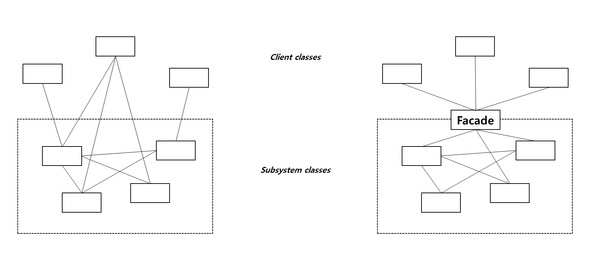

### 의도

복잡한 서브시스템을 단순한 인터페이스로 감싸, 클라이언트가 쉽게 사용할 수 있도록 합니다.
서브시스템의 내부 구성 요소를 감추고, 클라이언트와의 결합도를 낮춥니다.

### 활용성
- 복잡한 서브시스템을 단순한 인터페이스로 사용하고 싶을 때
- 추상 개념에 대한 구현 클래스와 사용자 사이에 너무 많은 종속성이 존재할 때
- 서브시스템을 계층화하여 계층에 대한 접근을 제공하기 싶을 떄

### 구조

### 구성요소
- Facade: 클라이언트가 사용하기 쉬운 인터페이스를 제공하는 클래스. 내부적으로 복잡한 서브시스템을 조정
- Subsystem Classes: 실질적인 기능을 수행하는 서브시스템 클래스들. Facade 에 대한 정보를 가지고 있지 않음.

### 특징

1. 서브시스템의 구성요소를 보호할 수 있음
2. 서브시스템과 사용자 코드 간의 결합도가 약해짐
3. 응용프로그램 쪽에서 서브시스템 클래스를 사용하는 것을 완전히 막지는 않기 떄문에, 클라이언트가 서브시스템을 직접 사용할 수는 있음

### 관련 패턴

- 추상 팩터리 패턴: 서브시스템 객체를 샏ㅇ성하는 인터페이스로 facade 를 사용할 수 있음
- 중재자 패턴: 기존 클래스들의 기능을 추상화한다는 면에서 유사함. 그렇지만 파사드는 서브시스템 인터페이스 자체를 추상화하는 방식임.

### 내 예제
- 물류센터에서는 자동화장비가 있음.
- 자동화장비는 운송장발행, 포장을 하나의 스탭으로 함.
- 그 외 방식에서는 운송장 발행 스탭과 포장 스탭이 나눠져 있음.

