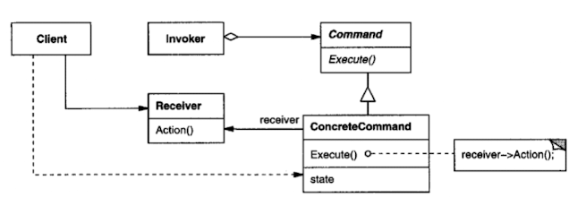
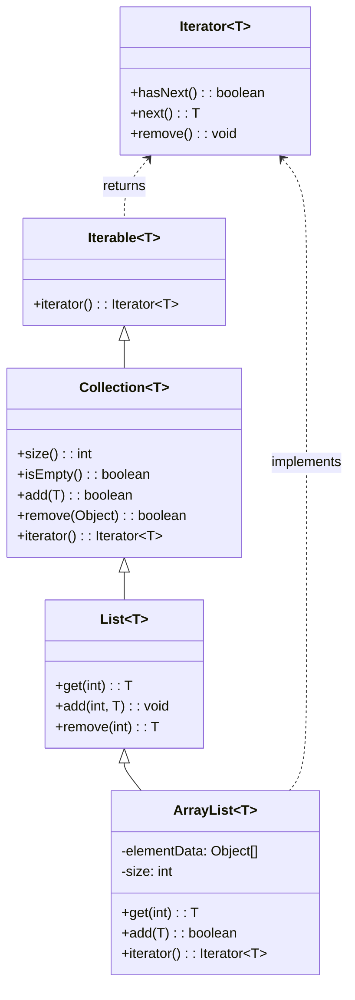

### 의도

컬렉션 내부 구조를 노출하지 않으면서, 그 안에 들어 있는 요소들에 접근하는 방법을 제공합니다.  
하나의 컬렉션에 대해 다양한 순회 방법을 제공하거나, 컬렉션과 순회 기능을 분리할 수 있습니다.

### 활용성

- 다양한 방식의 순회가 필요한 경우  
- 컬렉션의 내부 표현을 외부에 노출하지 않고 요소를 순회하고자 할 때  
- 다형적인 순회 방법이 필요한 경우 (예: 깊이 우선, 너비 우선 등)  
- 복합 객체 구조에서 일관된 방식으로 순회할 필요가 있을 때

### 구조

### 구성요소

- **Iterator**: 순회를 위한 인터페이스를 정의 (`first`, `next`, `isDone`, `currentItem`)
- **ConcreteIterator**: 실제 컬렉션에 대한 순회 기능 구현
- **Aggregate**: Iterator 객체를 생성하는 인터페이스 정의
- **ConcreteAggregate**: ConcreteIterator를 반환하는 실제 집합체

### 특징

1. **컬렉션과 순회 책임을 분리**  
   - 컬렉션은 요소 관리에 집중하고, 순회는 Iterator가 전담

2. **다양한 순회 방식 구현 가능**  
   - 하나의 컬렉션에 대해 여러 종류의 Iterator 제공 가능

3. **컬렉션 내부 구조에 영향을 주지 않음**  
   - 클라이언트는 컬렉션 구조를 몰라도 요소에 접근 가능

4. **복잡한 컬렉션 구조를 단순하게 순회 가능**  
   - Composite 패턴과 함께 사용되어 트리 구조를 쉽게 탐색 가능

### 관련 패턴

- **복합체 패턴(Composite Pattern)**:  
  - 복합 객체를 순회할 때 Iterator 패턴과 자주 함께 사용됨

- **팩토리 메서드 패턴(Factory Method Pattern)**:  
  - Iterator 객체 생성을 서브클래스에 위임할 때 사용

### 자바 Iterator 살펴보기

