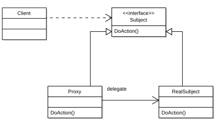
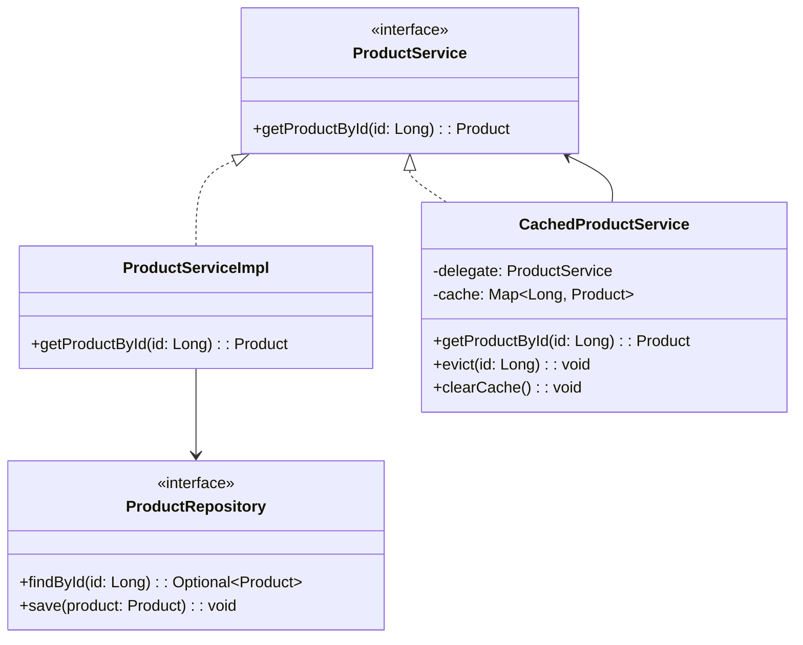

### 의도

다른 객체에 대한 접근을 제어하기 위해, 대리자의 역할을 하는 객체를 둠.

### 활용성

- 원격 프록시: 다른 주소 공간에 있는 객체에 대한 로컬 표현을 제공
- 가상 프록시: 비용이 많이 드는 객체를 대신하여 가볍게 대체. 고비용 객체는 실제로 필요할 때만 생성
- 보호 프록시: 클라이언트에 대한 객체에 대한 접근을 제어
- 스마트 참조자: 객체에 대한 추가적인 행동을 제공. 예를 들어, 객체가 실제로 사용되는 횟수를 추적하거나, 객체가 메모리에 있는지 확인

### 구조

### 구성요소

- Subject: Proxy와 RealSubject가 구현해야 하는 인터페이스
- Proxy: 실제 참조할 대상에 대한 참조자를 관리. subject와 동일한 인터페이스를 구현.
- RealSubject: Proxy가 대리하는 실제 객체

### 특징

- 다방면에 활용할 수 있거나 정교한 객체 참조자를 제공할 수 있음
- 책에서의 예시는 고비용 객체를 대신하여 가볍게 대체하는 예시를 들었음
- 책이 쓰여질 당시에만 해도 객체 생성 비용은 문제가 있었을 것 같음. 그러나 현대 프로그래밍에서는 더 큰 비용을 아끼기 위해 사용되기도 하는 것 같음.

### 관련 패턴

- decorator pattern: 구현 방법이 비슷하지만, 장식자는 하나 이상의 서비스를 추가하기 위함임. 프록시는 접근을 제어.

### 내 예시

상품 상세 조회에서, 캐싱을 적용.
스마트 참조자로 생각됨.

1. 테스트를 추가.
2. 처음에는 구현체를 바로 호출하면서 간단한 구조륾 가졌음.
3. extract interface 리팩터링을 통해 인터페이스를 도입.
4. 캐싱을 적용하기 위해 캐싱 로직을 추가하고, 구현체를 래핑하는 캐싱 구현체를 추가.

