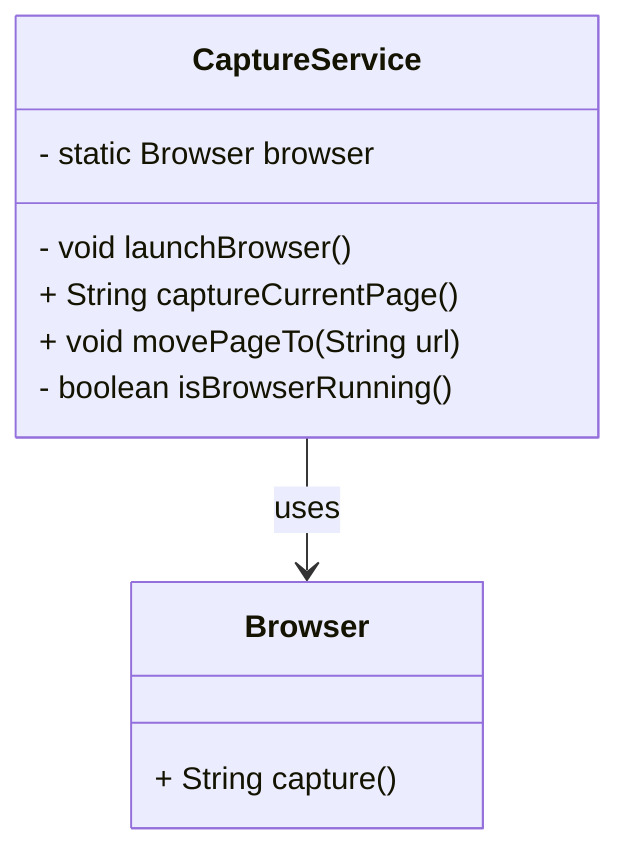

### 연관된 패턴

요구사항에 적합하다면 많은 디자인 패턴이 함께 사용될 수 있음

### 의도

오직 하나의 인스턴스만을 생성하고, 이에 대한 전역적인 접근점을 제공하는 패턴.

### 구성요소

• Singleton
• 유일한 인스턴스를 생성 및 관리
• private 생성자를 사용하여 외부에서 직접 인스턴스 생성을 방지
• 정적 메서드를 통해 인스턴스 반환

### Pros & Cons

• 인스턴스가 하나만 존재하도록 보장
• 동일한 리소스에 대한 중복 생성 방지
• 전역적인 접근점을 제공
• 어디서든 접근 가능하여 코드의 일관성을 유지
• 인스턴스가 미리 생성될 수 있음
• 필요할 때 초기화 가능 (lazy initialization) 또는 미리 생성 가능 (eager initialization)
• 단일 인스턴스가 전역 상태를 가지므로 의존성이 강해질 위험
• 의도하지 않은 공유 상태로 인해 테스트 및 유지보수가 어려워질 수 있음
• 멀티스레드 환경에서 동기화 문제

### 예시

- 브라우저를 통한 캡처를 제공한다
    - 실제로 운송장 발행을 위한 서비스가 이와 같은 방식으로 구현되었다.
- 서비스에서는 단 하나(single)의 브라우저만 사용해야 한다.
    - 만약 모든 요청마다 여러 브라우저를 실행하는 경우 리소스 소모가 심하다.
- 또한 브라우저는 외부 라이브러리 객체이기에, 직접 제어하는 것 보다는 추상화된 코드로 제공하는 것이 올바르다.

